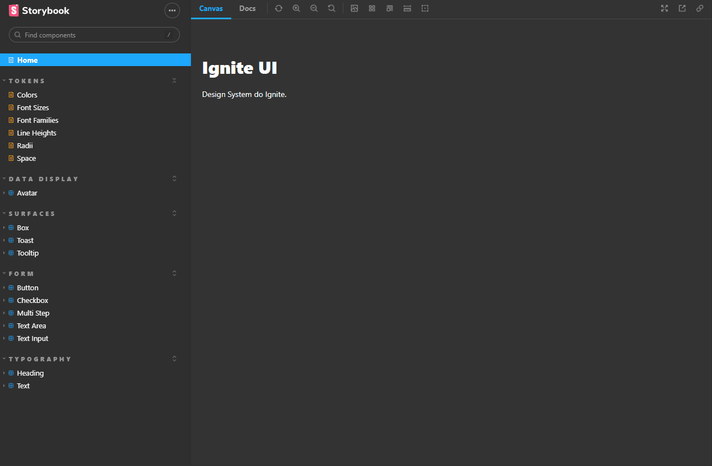

<h1>Estudos Ignite(React) - Etapa 05</h1>

 

 

Neste projeto desenvolvemos um Design System em React para o <a href="https://github.com/dhomini-rabelo/Estudos-Ignite-React-006">projeto da etapa 06</a>, acesse o site do Design System, publicado no github.io, clicando <a href="https://dhomini-rabelo.github.io/Estudos-Ignite-React-005/?path=/story/home--page">aqui</a>. Neste módulo o desafio individual foi apenas desenvolver os componentes de Toast e Tooltip.

<h3>🚀 Tecnologias</h3>
<ul>
    <li>Storybook (Vite)</li>
    <li>Stitches</li>
    <li>Phosphor-react</li>
    <li>radix-ui</li>
    <li>polished</li>
    <li>changesets, turbo e tsup para ajudar no versionamento</li>
</ul>

<h3>💻 Projeto</h3>

O Design System é muito útil para padronizar projetos e seguir padrões numa empresa, para melhorar a organização e dividir as responsabilidades o 
projeto está separado em 6 módulos.

 

<ul>

<li>
    <h4>ts-config</h4>
    

    Onde fica a configuração do Typescript do projeto
    

</li>

<li>
    <h4>eslint-config</h4>
    

    Onde fica a configuração do eslint do projeto
    

</li>

<li>
    <h4>tokens</h4>
    

    Onde fica a padronização de tamanhos, cores, fontes, espaçamento, etc. Esse padronização está escrita somente com objetos no Typescript, sendo muito fácil
    a integração com a biblioteca Stitches.
    

</li>

<li>
    <h4>react</h4>
    

    Desenvolvimento de componentes com stitches e radix-ui, configurando os stitches partir dos dados do módulo acima.
    

</li>

<li>
    <h4>docs</h4>
    

    É onde esta o Storybook, com nosso Design System. Mostrando a documentação de cada componente feito no módulo de React.
    

</li>

<li>
    <h4>Raiz (stage05)</h4>
    

    É onde estamos controlando o versionamento do projeto com a lib changeset, rodando os projetos em paralelo, no modo watch, com a lib turbo.
    

</li>

</ul>

